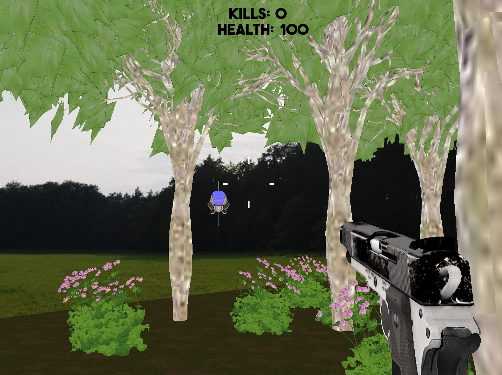
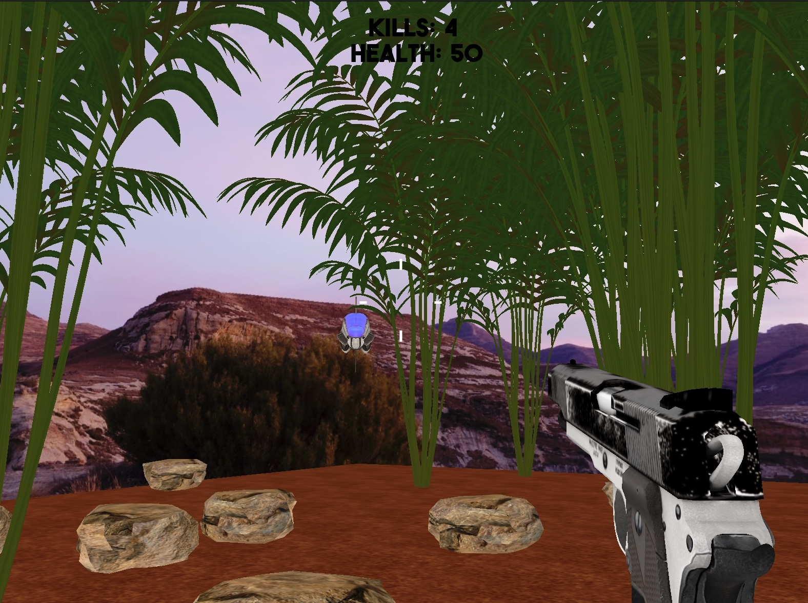
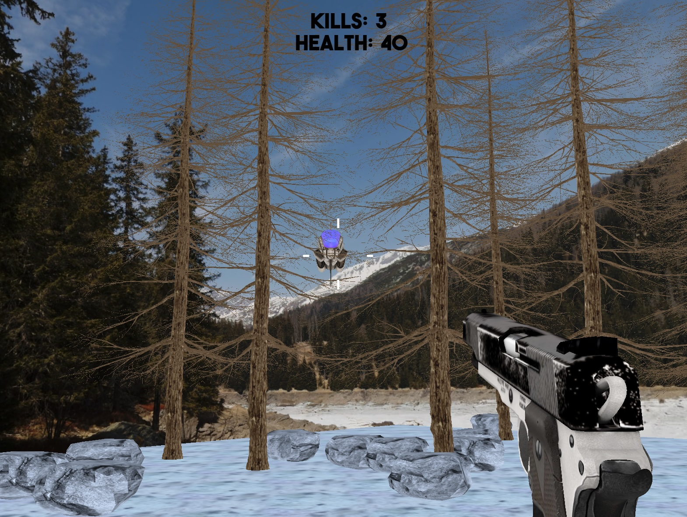
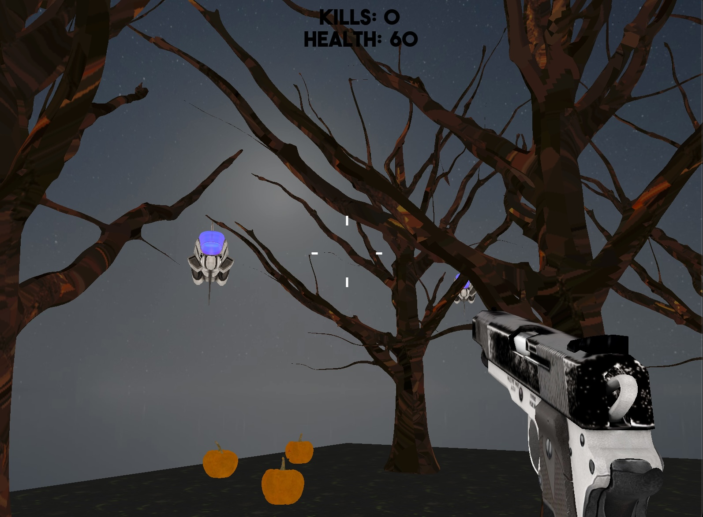
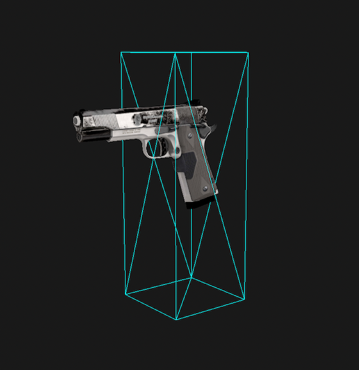
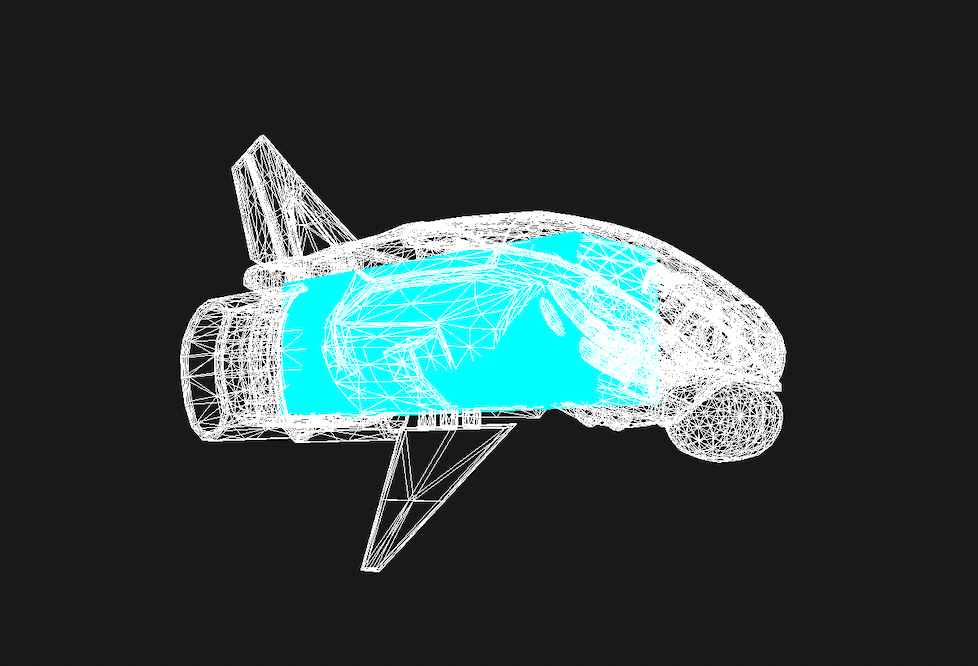

# Drone Shooter
[](https://github.com/opengl-drone-shooter/equity-bot-discord/actions)  
Drone Shooter is a simple FPS game created with OpenGL.  
The goal is to shoot as many drones as you can before they kill you.
There are four maps to choose from: forest, desert, snow and night. 


## About
Drone Shooter was created using just OpenGL, no game engine. It's purely done for fun and learning purposes.  
The inspiration for this project was [this](https://www.youtube.com/watch?v=wIIxI3P_TCc) OpenGL FPS game.

Some of the code is based on code from the [learnopengl tutorial](https://learnopengl.com/) by Joey de Vries,
such as shader.h, mesh.h and model.h.  

The game objects (models, sounds, font and textures) were all downloaded for free from the internet.  
I used sites like [free3d](https://free3d.com/), [soundjay](https://www.soundjay.com/gun-sound-effect.html) and [freebpr](https://freepbr.com/). Unfortunately I did not save the exact links to the used objects.  

To implement collision detection between the player’s bullet and enemy and between the enemy’s laser beam and player [this](https://www.scratchapixel.com/lessons/3d-basic-rendering/minimal-ray-tracer-rendering-simple-shapes/ray-box-intersection) site was a great resource. Box.h and ray.h are based on code from that site. 

For adding soundeffects, rendering text and loading 3D models the libraries [miniaudio](https://github.com/mackron/miniaudio), [freetype](http://freetype.org/) and [assimp](https://github.com/assimp/assimp) were used.

### Maps
#### Forest     


#### Desert   


#### Snow  


#### Night
  

### Player
There is no actual player character, it’s just a gun. The direction of the bullet is the same as the front vector of the player, which makes aiming easy. The player’s bounding box looks as follows:



### Enemy
The enemy is a drone that can shoot laser beams. Its aim is not perfect; some randomness is added when calculating the direction of the laser beam, otherwise every shot would lead to a decrease in the player’s health.   
The bounding box of the enemy does not cover the whole drone, as can be seen in the image below. It may look weird but it’s not a problem at all. The bounding box is still big enough so that hitting the drone is quite easy, even when standing far away. 



## Building and Running the Game (macOS - arm64) 
### Prerequisites

- [CMake](https://cmake.org) (version 3.5 or higher)
- C++ Compiler with C++17 support
- [Git](https://git-scm.com)

### Instructions
1. Clone this Repository

    ```bash
    git clone https://github.com/EtoileScintillante/opengl-drone-shooter.git
    cd opengl-drone-shooter
    ```

2. Build the Game

    ```bash
    mkdir build
    cd build
    cmake ..
    cmake --build .
    ```

3. Run the Game (executable not in build dir)

    ```bash
    ./Drone-Shooter
    ```

## Evolution of the game
During the development I regularly uploaded videos to YouTube to keep track of the progress I made.

- [12 Sept. 2022](https://youtu.be/qpYmfjfTjCA) Minecraft scenery (starting point)
- [23 Sept. 2022](https://youtu.be/ef7LN32q7J0) migration to more realistic scenery
- [3 Oct. 2022](https://youtu.be/Qg2YRp42_rg) added sound effects
- [17 Oct. 2022](https://youtu.be/Spv8I2WCzuU) improved enemy movement and added text on screen
- [22 Oct. 2022](https://youtu.be/Ox03BBIdRAc) enemies can kill player
- [30 Dec. 2023](https://youtu.be/4EliOM1DS_s) new maps: forest, desert, snow and night